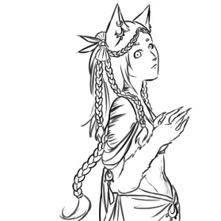

# Races of Anesir

## Races of the old world

Most races of the old world can be encountered in Anesir although mainly concentrated in the eastern part of the continent.

## Races specific to Anesir

1. [Dagbloed](#dagbloed)
2. [Nagbloed](#nagbloed)
3. [Sayanaki](#sayanaki)
4. [Denarii](#denarii)
5. [Animae](#animae)
6. [Kalar](#kalar)

### Dagbloed

### Nagbloed

### Sayanaki

### Denarii

### Animae

Humanoids with wolflike features, Animae dwell in dense forests in small clans. Mighty hunters, shiny trinket amateurs, these free spirits love nothing more than their freedom.

#### Small and Agile

Slightly shorter than humans, Animae tend to have a slender build with muscular legs. They tend to be light compared to humans, and they compensate their frailty with speed. They are humanoid but present some animal characteristics: big furry ears, a dog-like nose, and a thick fur covering their forearm and calves. Their legs look like an animal’s and their fingers end in sharp claws.  
While only a few can wear this form to battle, most Animae can shapeshift into huge wolves.

Animae tend to have tan skin, but their skin tone can range from almost pitch-black to a pale skin with pink undertones. Most of them present stripes of some sort on their shoulders, waist and neck and the pattern can be indicative of certain clans. Their body is covered in a soft, thin fuzz that closely matches their skin or fur colour. They cannot grow any kind of facial hair.  
Male or female, Animae tend to favor elaborate braids, shiny jewelry and usually keep their hair long and decorated with feathers, seashells, etc.

#### Free spirits

Animae age faster and have a shorter lifespan than humans. At 50, they are considered elderly. As such, an Anima’s life goes by fast, and they do notlike wasting their time doing things they do not want to do.  
Volatile, unfocused, they tend to be unpredictable. They do not have time to follow orders or swear oaths: their short time on earth should be enjoyed to the fullest. They tend to be self-serving, but do not like to bring harm on purpose. Very social, they tend to get friendly very quickly. The only thing that trumps their desire for freedom is their loyalty to their clan and family.
Due to their volatile nature, Animae tend not to hold grudges or dwell on the past too long. They are always rushing to move forward and onwards to a new adventure. They do not write stories down but hoard various items that are passed down along with epic tales, and the memory of a clan lives on through these.  

#### Comfortable Dens

Animae are forest dwellers. They seek dense forests with the biggest possible trees. They try to leave the environment as untouched at possible and exploit natural formations when they can. Smaller clans sometimes settle in shallow caves, but most Animae live aboveground. They weave nets and make suspended nests that hang from big trees’ branches. These homes are reinforced with leather, tree bark or any material readily available. An entire Anima clan is usually composed of about 70 individuals, and they all live together as much as possible. The nests are connected by a great number of ropes, ladders, bridges and nets. Elders and families with small children live in tents on the ground. The inside of the nests is made as comfortable as possible, and each Anima tends to hoard their favourite items inside. The bottom of a nest is usually covered in furs, duvet, soft moss or cushions.  
Anima clans are tight-knit and even if the members come and go as they please, they will always be welcomed back. Outsiders, however, are met with caution. The clan is led by the eldest females, who are usually the only authority an Anima will answer to.  

#### Unbridled Curiosity

While some seek fame, glory or have some noble goal behind their adventure, Animae’s goals tend to be much simpler. While a few of them venture out on clan business, most are simply driven by curiosity about the world outside their clan’s territory. Going on an adventure is a dream opportunity to bring back shiny trinkets or make cubs’ eyes sparkle with incredible stories. It is common for an Anima to leave on a mighty quest and simply to acquire a rare item that struck their fancy.

#### Secretive and wary

While an Anima out in the world can be very open and friendly, Animae protect their clan’s territory fiercely and will bare their fang at anyone trying to intrude. Few are those who can be accepted into these closed communities, but one who manages to gain their trust is a member of the clan forever.

#### Magic haters

Although Animae respect druids greatly, they have a strong aversion for any other kind of magic. Sorcerers are seen at the bearers of a great curse, and any Anima who practices magic in one way or another is sure to be shunned and despised by their people.  

#### Anima Names

An Anima’s name is made of two parts. Their first name is given by the clan’s matriarchs on their first transformation. This name is usually descriptive, composed of one or two words. These names are usually unisex. It can describe the Anima themself, or the hopes the clan has for their future. In rare circumstances, an Anima can change their name later in life if they feel their current name no longer suits the path they have taken.  
In case a cub is unable to transform, they are given a simple first name without any meaning when they start talking. These names are inspired by those of any other race, with a preference for short names, flowing sonorities and numerous vowels. Since Anima names are usually not gendered, it is possible for a male to end up with a feminine name and vice-versa.

The clan name is the second part of an Anima’s name. It usually reflects a physical characteristic shared by all members of the clan, but as clans mix and merge, this is not always true. It can also be after the clan’s settlement location or a noteworthy item they possess.

Transformed names:  
Sandstorm, Star Shard, Ange-de-Mort, Blood Claws, Traquevent, Feu Follet  
Untransformed names:  
Kalaë, Helen, Alduin, Albrecht, Camille  
Clan names:  
Patte-Grise, Oeil-du-Nord, Dragonskin, Noire-Fourrure, Croc-Tranchant, Griffe-Dorée, Riversong, Haute-Falaise

#### Anima Traits

An anima character has a variety of inborn characteristics due to their wild nature.

##### Ability score increase

An animae has a bonus of 2 to their dexterity and a bonus of 1 to another characteristic of their choice.

##### Age

Animae grow up and age quickly. They walk a few months after birth, and transform before the end of the first year, usually before they can even talk. They reach maturity around 13 and are considered full-fledged warriors at 15 and allowed to leave the clan. They are considered elderly after 50 years old and rarely live past 60.

##### Alignment

Animae tend to be chaotic, pursuing entertainment and freedom before all. They care little for rules unless they have been decided by the matriarchs. They tend towards neutral as they are self-serving but will avoid bringing harm to others if they can. However, they usually do not care about how inconvenient they can be to others.

##### Size

Animae are usually around 5 feet tall and weigh around 100 pounds. Their size is medium.  
When they take their wolf form, Animae are usually around 3 feet tall and between 5 and 6 feet long, but some can grow larger. The transformation also adds 100 pounds or so to their weight. Under this form, their size is still medium.

##### Speed

Your base walking speed is 30 feet. Additionally, your sharp claws provide you with a climbing speed of 30 feet.

##### Darkvision

Nocturnal hunter, you have superior vision in dark and dim conditions. You can see in dim light within 60 feet of you as if it were bright light, and in darkness as if it were dim light. You can’t discern color in darkness, only shades of gray.

##### Wolf's Claws

Because of your claws, you have a climbing speed of 30 feet. In addition, your claws are natural weapons, which you can use to make unarmed strikes. If you hit with them, you deal slashing damage equal to 1d4 + your Strength modifier, instead of the bludgeoning damage normal for an unarmed strike.

##### Hunter’s senses

You have proficiency in the Perception skill.

##### Shapeshifting

Animae can shapeshift at will into and out of their animal form.
The transformation takes about one minute each way.  
In their animal form, Animae gain the following benefits:
- Advantage on smell and hearing based Perception checks.
- Their natural weapon damage increases to 1d6 slashing (str or dex).
- Their speeds increase to 50 ft.

In their animal form, Animae can't:
- Use any weapon besides their claws.
- Wear any armor. Base AC is still 10 + Dex bonus.
- Cast any spells (transforming doesn't break concentration or prevent from taking actions that are part of spells that were already cast)
- Speak any language besides Wolftongue. (They can still understand the same languages as in humanoid form)

An animae's equipment merges with their animal form (similarly to Druid's Wild Shape).  
When transformed, Animaes can carry creatures up to one size smaller than them.

Instead of taking a minute to transform into their animal form, Animaes can also transform using a single bonus action. This is, however, a tiring process. This power recharges during either a long rest or a hearty meal.

Non-Transforming Animaes (Variant):  
Some Animae simply cannot shapeshift and are as a result seen as inferior by their peers. They do not have the shapeshifting trait but gain proficiency in the Nature and Survival skills.  

##### Tool Proficiencies

You have proficiency with the tool of your choice:  
Alchemist’s supplies, Leatherworker’s tools, Weaver’s tools, Woodcarver’s tool, Herbalism Kit 

##### Protective Fur

Animaes have resistance against cold damage.

##### Languages

Most Animaes can speak and read Common but cannot write.   
Animaes can also speak Wolftongue. Wolftongue, the language of the Animae is a smooth and soft language with occasional harsh and guttural sounds. There is no written alphabet for it.

### Kalar
