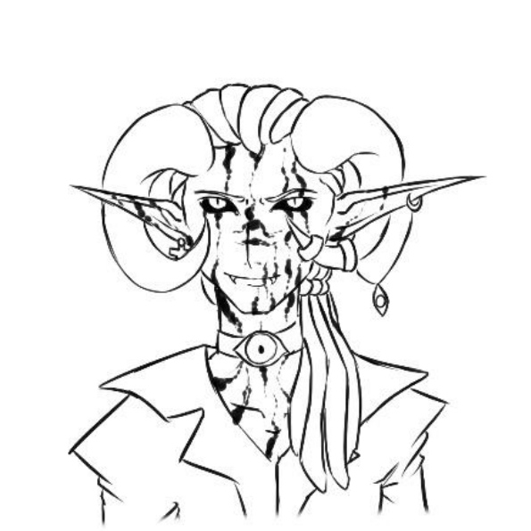
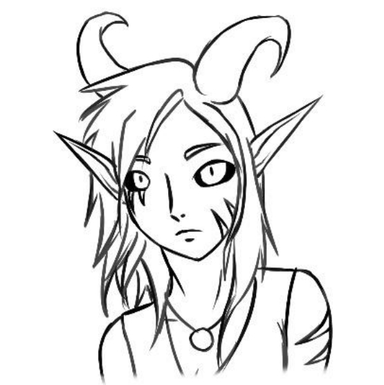
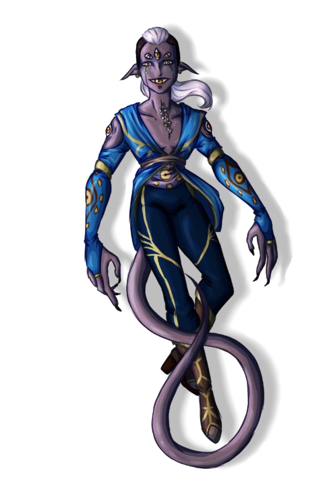
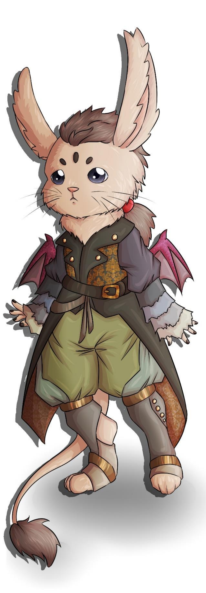

# Races of Anesir

## Races of the old world

Most races of the old world can be encountered in Anesir although mainly concentrated in the eastern part of the continent.

## Races specific to Anesir

1. [Dagbloed](#dagbloed)
2. [Nagbloed](#nagbloed)
3. [Sayanaki](#sayanaki)
4. [Denarii](#denarii)
5. [Animae](#animae)
6. [Kalar](#kalar)

### Dagbloed

### Nagbloed

Descended from Dagbloed who swore loyalty to the Night God instead of the Sun Goddess, the Nagbloed walk in the shadows and still nurture their kind’s past dreams of conquest.

#### Marked by Evil

Nagbloed are similar to their sun-loving cousins. They are tall, with long, pointy ears, big horns, reddish skin, sharp fangs and black sclera. However, their allegiance appears on their skin in the form of black markings. Nagbloed tend to have very pale, almost white hair, but a great number of them dye it in extravagant colours to their liking. They tend to wear large, dark clothing, sometimes decorated with eyes. They like wearing ornate jewellery, especially if said items are enchanted.

#### Gift of Long Life

While their surface-dwelling brethren barely live longer than a century, Nagbloed can easily live for 200 years. From their late teens to the day of their death, they fill their life with research, pursuit of knowledge and power. They are driven by hatred and greed and tend to be distant and aggressive even towards each other. However, when they get attached, they tend to become fiercely loyal, although overly jealous and possessive. Their grudges last long and their revenge is often disproportionate compared to the offense.  
They are very loyal to their rulers and their God, less so to their family.

#### Underground Dwellings

Despite their differences, Dagbloed and Nagbloed still form one civilization and they tend to live at the same place, although their cities could be considered as separate. Nagbloed build underground cities under Dagbloed cities, exploiting natural cave formations or digging their own tunnels. If possible, a Nagbloed city is built around an underground lake or current. They use the same materials as Dagbloed, but their buildings are small and closed. They do not bother with windows or other unnecessary openings and exclusively use magically reinforced red stone. The city’s temple, dedicated to the Night God, is the only building built following Dagbloed architectural model. The cities are dense and magic lights always bathe them in a dim light. The streets are often patrolled with guards and dark alleyways are rife with beggars and prostitutes.  
In caverns separated from the rest of the city, Nagbloed farm roots, mushrooms and algae for sustenance. They also raise some creatures as cattle such as giant badgers, giant bats and giant insects.  
Nagbloed are led by priests appointed by the Necromancer’s guild. They oversee the city’s infrastructure and act as an interface between the Necromancers and the uninitiated population.

#### Greed and lust for power

Nagbloed are rarely driven by altruistic motives. When they leave their underground city to meddle with the other races, they always make sure they will get something out of it. To seek dark knowledge or a powerful artefact, or sent as envoys or spies by their leaders, they are driven by their own selfishness and fanaticism.

#### Untrustworthy allies

Even more secretive than their surface cousins, the very existence of the Nagbloed is a mystery among the other races. However, they do trade abundantly with the Dagbloed and send envoys in powerful leaders’ courts to form alliances. Due to their tendency to turn on their allies as soon as their goal is reached, those who wish to use the Nagbloed’ powers have to consider the risks very carefully.

#### The Necromancers' Guild

The Necromancers’ Guild is a cult of fanatics devoted to the Night God. It is mainly composed of Nagbloed but welcomes members of all other races. To enter the cult, one must go through complex rituals and be personally approved of by an initiated member of the cult. As the closest to the Night God, they rule over the Nagbloed. The Hierophant leads the Guild, and they are considered to speak directly for the Night God. A new Hierophant is appointed by the three Archpriests of the Guild upon the death of the previous leader. For the first time in the Guild’s history, the current Hierophant is a human.

#### Nagbloed Names

Nagbloed follow the same naming conventions as Dagbloed. Members of other races who join the Necromancer’s guild take a name in the same fashion.

\page

#### Nagbloed Traits

You are under the Night God’s protection. You do not know what it will cost you yet, but as a Nagbloed you have the following traits:  

**Ability score increase** :: Your Charisma score increases by 2.

**Age** :: The Night God grants you long life. His followers mature at the same rate as humans but can live to be 200 years old.

**Alignment** :: Nagbloed have turned their back on the Sun Goddess, but they still follow the Night God’s precepts. They tend to be lawful. However, their lust for power draws them towards Evil.

**Size** :: Nagbloed have the same size and frame as any Dagbloed. Your size is medium.

**Speed** :: Your base walking speed is 30 feet.

**Darkvision** :: You have lived in the shadows for as long as you can remember. You have superior vision in dark and dim conditions. You can see in dim light within 60 feet of you as if it were bright light, and in darkness as if it were dim light. You can’t discern colour in darkness, only shades of grey.

**Walk in Shadows** :: You have proficiency in the Stealth skill.

**Language** :: You can speak, read and write Common, Sanguis and Abyssal.

##### Subraces: Icarean

  
Icarean Nagbloed descend from Sun-Scorched Dagbloed who prayed to the Sun Goddess for an even greater power. As a punishment for their greed, the Goddess burned them in fire and cursed them to never be able to bear the sunlight. They look like Sun-Scorched Dagbloed but dark scars run across their bodies.

**Ability Score Increase** :: Your constitution score increases by 1. Your strength score increases by 1.

**Daylight Hater** :: The sunlight weakens you. You have a disadvantage on attack rolls, ability checks and saving throws relying on strength and dexterity if you stand in direct sunlight.

**Superior Darkvision** :: Your Darkvision increases to 120 feet.

**Slithering Shadow** :: Your movement speed increases to 35 feet.

**Armour training** :: You have proficiency with light and medium armour.

##### Subraces: Nekros

First followers of the Night God cast aside as Dagbloed became more peaceful, they prayed to their God for power, and it was granted to them at a cost. Their horns relatively small and curve backwards, and black markings run across their face and bodies, looking like tattoos.

**Ability score increase** :: Your Dexterity score increases by 1.

**Assassin Training** :: You have proficiency with the dagger, rapier, shortbow and longbow.

**Dark Resistance** :: You have resistance against necrotic damage.

**Dark Knowledge** :: You are proficient in the Arcana skill.

**Erudite** :: You learn one extra language.

### Sayanaki

### Denarii

They came from a destroyed plane along with their eternal enemies, the Sayanaki. Their bloody history, full of war and hatred, ended abruptly as they now live in poverty, reduced to servitude.

#### Unsettling appearance

A Denarii’s physique always makes them stand out, and the attention they receive is rarely positive. Their frame and build are similar to humans, but their physical appearance is wildly different. At first glance, they seem to have five eyes, always glancing everywhere, but an attentive observer will notice that what seems to be a mouth is actually an eyelid. Their actual mouth is right under their throat, full of apparent sharp teeth, but they do use their decoy mouth to convey the same kind of facial expressions as any humanoid. They have long, pointy and slightly droopy ears. On their upper arms, two more eyes are ever watchful. Another noticeable trait of the Denarii is their long tail. It’s covered it tiny spikes allowing it to grip objects.

Denarii’ skin can be of any color, but it is usually dark and greyish. It is covered in a thin layer of mucus. Their hair grows in two or more colors, which may or may not form patterns.  
Denarii pay close attention to their appearance and like to wear intricate clothing coated in a water repellent substance to accommodate their slimy skin.

#### Flamboyant and Grandiloquent

Denarii tend to be very expressive and take up a lot of space in a room. Whether it is through their elaborate outfits, colorful skin and hair, dramatic manners or unusual appearance, they tend to draw attention on themselves, and often revel in it. They tend to be social but seem to consider themselves superior to most of the other races. They are confident and proud, even after being defeated and brought into servitude. They sometimes appear condescending and often only form surface-level relationships with other races and tend to stick together with their peers.  
\page
Despite their arrogance, they seem to fear the unknown. They are a bit too quick to trust their own race, and a bit too stubborn in their mistrust of the others.
Denarii also often think of themselves as artists and seek to bring beauty to the world and to themselves. They often take inspiration from nature for their clothing and patterns.

#### Always Ready

Denarii never built great cities. They lived a nomadic lifestyle for most of their history but started gathering in bigger communities when as the scale of their wars with the Sayanaki increased. They often build fortified villages or encampments in areas with high relief such as mountains or hills. Most of their buildings are made of wood or cloth, bone and hide. Their furniture is light and can be easily moved. Although their lifestyle is becoming more sedentary, Denarii are always ready to move out when threatened. They raise resilient cattle and always have a stock of non-perishable food to take with them should they leave their settlement. They use magic to maintain their crops and accelerate their growth.
Since the end of the Greater War, Denarii also inhabit districts in Sayanaki cities. These districts are often poor and rife with crime and soldiers are patrolling them day and night. The Denarii living there see themselves as prisoners rather than citizens of the city and are often used by the Sayanaki for cheap labour.

#### Denarii and Warlocks

Due to their past history, warlocks have become exceedingly rare among Denarii. Few otherworldly patrons would accept to deal with them after the cruel betrayal they experienced, and such a pact often comes at a high cost.

#### Mutual mistrust

Denarii are wary of strangers, and this defiance goes both ways. Be it because of their appearance or their involvement in too many wars, most races have a hard time trusting them. However, their exuberant and extroverted nature makes them great drinking partners and distant friends.

#### Denarii Names

Denarii names often sound rough and have very few vowels. Most first names are unisex. They do not have family or clan names but love giving themselves extravagant titles, which they change depending on what they deem their most impressive achievement or feature. When traveling outside of their homeland, a Denarii will often take a surname that reminds them of their home village. It can be the name of a landmark, the name of the settlement or even the name of someone living there.  
First names:  
Brath, Murth, Narrmer, Hresla, Chturla, Trengarth, Zarmarth  
Surnames:  
Seastar, Twisted Tor, Zelavari, Threphr, Pinewood, Dragonbone  
Full names:  
Sarrsif Bluelagoon the Feather-Catcher, Berrg Eveltor the Glistening, Mirmar Grerrth Killer-of-Bulettes

#### Redemption and Revenge

Denarii take up adventuring life for many reasons. Since the fall of their king, none of them are bound to an oath or orders. Some take the roads to escape the dire life conditions, to seek ways to take revenge and restore their people’s former glory, to accomplish deeds that would make them worthy of a new title, or to try to atone for their people’s sins. One way or another, they often seek a freedom their homeland can no longer give them.

#### Denarii Traits

**Ability Score Increase** :: Your Charisma score increases by 2 and your Intelligence score increases by 1.

**Age** :: Denarii reach their physical maturity around 25 years old and consider themselves full-fledged adults at 30. They usually live between 150 and 200 years.

**Alignment** :: The Denarii are often independent and somewhat always look for freedom even under the strictest rules. They tend to be Chaotic, and do not tend towards one particular moral alignment.

**Size** :: Denarii tend to be between 5 and 6 feet tall, with females being slightly taller than males. They weigh around 150 pounds. Their build is similar to humans’. Your size is medium.

**Speed** :: Your base walking speed is 30 feet.

**All-seeing eyes** :: Your numerous eyes are always watching. You have proficiency in the Perception skill, and you have advantage on wisdom (perception) checks that rely on sight. You cannot avert your eyes.

**Darkvision** :: Thanks to your sharp eyes, you have superior vision in dark and dim conditions. You can see in dim light within 120 feet of you as if it were bright light, and in darkness as if it were dim light. You can’t discern color in darkness, only shades of gray.

**Prehensile Tail** :: Your long tail is covered in little spikes, allowing you to use it to grab objects. You can also use it as a natural weapon dealing 1d6 + your strength modifier bludgeoning damage, and you can use it to grapple small and tiny creatures.

**Mage Ancestry** :: You know the minor illusion cantrip.

**Stigma of the past** :: You cannot escape from the sins of your people. Undead and fiend creatures are naturally wary of you and you have a disadvantage to interact with them socially. They are more likely to target you in a fight.
\page
**Languages** :: You can speak, read and write common and Estrellean. Estrellean is the language spoken by the inhabitants of the Lost Planes. It’s a very rough-sounding language with a complex grammar, and it uses celestial script.

### Animae

Humanoids with wolflike features, Animae dwell in dense forests in small clans. Mighty hunters, shiny trinket amateurs, these free spirits love nothing more than their freedom.

#### Small and Agile

Slightly shorter than humans, Animae tend to have a slender build with muscular legs. They tend to be light compared to humans, and they compensate their frailty with speed. They are humanoid but present some animal characteristics: big furry ears, a dog-like nose, and a thick fur covering their forearm and calves. Their legs look like an animal’s and their fingers end in sharp claws.  
While only a few can wear this form to battle, most Animae can shapeshift into huge wolves.

Animae tend to have tan skin, but their skin tone can range from almost pitch-black to a pale skin with pink undertones. Most of them present stripes of some sort on their shoulders, waist and neck and the pattern can be indicative of certain clans. Their body is covered in a soft, thin fuzz that closely matches their skin or fur colour. They cannot grow any kind of facial hair.  
Male or female, Animae tend to favor elaborate braids, shiny jewelry and usually keep their hair long and decorated with feathers, seashells, etc.

#### Free spirits

Animae age faster and have a shorter lifespan than humans. At 50, they are considered elderly. As such, an Anima’s life goes by fast, and they do notlike wasting their time doing things they do not want to do.  
Volatile, unfocused, they tend to be unpredictable. They do not have time to follow orders or swear oaths: their short time on earth should be enjoyed to the fullest. They tend to be self-serving, but do not like to bring harm on purpose. Very social, they tend to get friendly very quickly. The only thing that trumps their desire for freedom is their loyalty to their clan and family.
Due to their volatile nature, Animae tend not to hold grudges or dwell on the past too long. They are always rushing to move forward and onwards to a new adventure. They do not write stories down but hoard various items that are passed down along with epic tales, and the memory of a clan lives on through these.  

#### Comfortable Dens

Animae are forest dwellers. They seek dense forests with the biggest possible trees. They try to leave the environment as untouched at possible and exploit natural formations when they can. Smaller clans sometimes settle in shallow caves, but most Animae live aboveground. They weave nets and make suspended nests that hang from big trees’ branches. These homes are reinforced with leather, tree bark or any material readily available. An entire Anima clan is usually composed of about 70 individuals, and they all live together as much as possible. The nests are connected by a great number of ropes, ladders, bridges and nets. Elders and families with small children live in tents on the ground. The inside of the nests is made as comfortable as possible, and each Anima tends to hoard their favourite items inside. The bottom of a nest is usually covered in furs, duvet, soft moss or cushions.  
Anima clans are tight-knit and even if the members come and go as they please, they will always be welcomed back. Outsiders, however, are met with caution. The clan is led by the eldest females, who are usually the only authority an Anima will answer to.  

#### Unbridled Curiosity

While some seek fame, glory or have some noble goal behind their adventure, Animae’s goals tend to be much simpler. While a few of them venture out on clan business, most are simply driven by curiosity about the world outside their clan’s territory. Going on an adventure is a dream opportunity to bring back shiny trinkets or make cubs’ eyes sparkle with incredible stories. It is common for an Anima to leave on a mighty quest and simply to acquire a rare item that struck their fancy.

#### Secretive and wary

While an Anima out in the world can be very open and friendly, Animae protect their clan’s territory fiercely and will bare their fang at anyone trying to intrude. Few are those who can be accepted into these closed communities, but one who manages to gain their trust is a member of the clan forever.

#### Magic haters

Although Animae respect druids greatly, they have a strong aversion for any other kind of magic. Sorcerers are seen at the bearers of a great curse, and any Anima who practices magic in one way or another is sure to be shunned and despised by their people.  

#### Anima Names

An Anima’s name is made of two parts. Their first name is given by the clan’s matriarchs on their first transformation. This name is usually descriptive, composed of one or two words. These names are usually unisex. It can describe the Anima themself, or the hopes the clan has for their future. In rare circumstances, an Anima can change their name later in life if they feel their current name no longer suits the path they have taken.  
In case a cub is unable to transform, they are given a simple first name without any meaning when they start talking. These names are inspired by those of any other race, with a preference for short names, flowing sonorities and numerous vowels.  
\page
Since Anima names are usually not gendered, it is possible for a male to end up with a feminine name and vice-versa.  

The clan name is the second part of an Anima’s name. It usually reflects a physical characteristic shared by all members of the clan, but as clans mix and merge, this is not always true. It can also be after the clan’s settlement location or a noteworthy item they possess.

Transformed names:  
Sandstorm, Star Shard, Ange-de-Mort, Blood Claws, Traquevent, Feu Follet  
Untransformed names:  
Kalaë, Helen, Alduin, Albrecht, Camille  
Clan names:  
Patte-Grise, Oeil-du-Nord, Dragonskin, Noire-Fourrure, Croc-Tranchant, Griffe-Dorée, Riversong, Haute-Falaise

#### Anima Traits

An anima character has a variety of inborn characteristics due to their wild nature.

**Ability Score Increase** :: An animae has a bonus of 2 to their dexterity and a bonus of 1 to another characteristic of their choice.

**Age** :: Animae grow up and age quickly. They walk a few months after birth, and transform before the end of the first year, usually before they can even talk. They reach maturity around 13 and are considered full-fledged warriors at 15 and allowed to leave the clan. They are considered elderly after 50 years old and rarely live past 60.

**Alignment** :: Animae tend to be chaotic, pursuing entertainment and freedom before all. They care little for rules unless they have been decided by the matriarchs. They tend towards neutral as they are self-serving but will avoid bringing harm to others if they can. However, they usually do not care about how inconvenient they can be to others.

**Size** :: Animae are usually around 5 feet tall and weigh around 100 pounds. Their size is medium.  
When they take their wolf form, Animae are usually around 3 feet tall and between 5 and 6 feet long, but some can grow larger. The transformation also adds 100 pounds or so to their weight. Under this form, their size is still medium.

**Speed** :: Your base walking speed is 30 feet. Additionally, your sharp claws provide you with a climbing speed of 30 feet.

**Darkvision** :: Nocturnal hunter, you have superior vision in dark and dim conditions. You can see in dim light within 60 feet of you as if it were bright light, and in darkness as if it were dim light. You can’t discern color in darkness, only shades of gray.

**Wolf's Claws** :: Because of your claws, you have a climbing speed of 30 feet. In addition, your claws are natural weapons, which you can use to make unarmed strikes. If you hit with them, you deal slashing damage equal to 1d4 + your Strength modifier, instead of the bludgeoning damage normal for an unarmed strike.

**Hunter’s senses** :: You have proficiency in the Perception skill.

**Tool Proficiencies** :: You have proficiency with the tool of your choice from Alchemist’s supplies, Leatherworker’s tools, Weaver’s tools, Woodcarver’s toolor  Herbalism Kit.

**Protective Fur** :: You have resistance against cold damage.

**Languages** :: Most Animae can speak and read Common but cannot write. Animae can also speak Wolftongue. Wolftongue, the language of the Animae is a smooth and soft language with occasional harsh and guttural sounds. There is no written alphabet for it.

##### Shapeshifting

As an Anima, you can shapeshift at will into and out of your animal form to go about your day.
The transformation takes about one minute each way.  
In your animal form, you gain the following benefits:

- Advantage on smell and hearing based Perception checks.
- Your natural weapon damage increases to 1d6 slashing (str or dex).
- Your speed increases to 50 ft.

In your animal form, you can't:

- Use any weapon besides your claws.
- Wear any armor. Base AC is still 10 + Dex bonus.
- Cast any spells (transforming doesn't break concentration or prevent from taking actions that are part of spells that were already cast)
- Speak any language besides Wolftongue. (You can still understand the same languages as in humanoid form)

An anima's equipment merges with their animal form (similarly to a Druid's Wild Shape).  
When transformed, you can carry creatures up to one size smaller than you.

Instead of taking a minute to transform into their animal form, you can also transform using a single bonus action. This is, however, a tiring process. This power recharges during either a long rest or a hearty meal.

**Non-Transforming Animae (Variant)** :: Some Animae simply cannot shapeshift and are as a result seen as inferior by their peers. They do not have the shapeshifting trait but gain proficiency in the Nature and Survival skills.  

\page

### Kalar

#### Small and soft

Kalar are small humanoid creatures, sharing some features with bunnies. Their legs end in flat feet like rabbits, and their whole body is covered in thick and soft fur, which they shed in autumn and spring, and can be any shade of grey or brown. Their skin underneath is black or dark pink. Kalar have small, dark-colored round eyes, and large rabbit ears which may be perked straight up or floppy. Small wings sprout from their back, with a wingspan of about 1 foot. Their wings can appear scaly like a dragon’s, leathery like a bat’s, feathery like a bird’s or even be dragonfly wings. Kalar have a thin tail ended in a tuft of thick fur.  
Kalar make no clear distinction between genders in the way the dress or fashion themselves, and an outsider may have a hard time telling males and females at a glance.

#### Sky explorers

Kalar live their whole lives roaming the sky aboard huge airships. Powered by intricate magic and complex mechanisms, these airships allow a group of Kalar to live up in the air for months. Kalar spend most their lives in the sky, surveying the continent and transporting goods across different regions.  
The magical trinkets they make and the fabric they weave from long-haired rabbit wool always fetch a good price.  

#### Life in the air

Spending most of their lives high up in the air, Kalar face many challenges. While most of their food comes from trade with land-dwellers, they also raise small animals for food. Dedicated rooms of the airships hold broods of long-haired rabbits and flightless birds, providing them with meat, wool, and eggs. On sunny days when the sea is calm, they also lower their airships to fish.  
Life on the airships require a lot of discipline, and Kalar are expected to help out around the ship from a young age. Most Kalar find themselves enjoying hard work, and fill whatever free time they have left with manual crafts and deep study of lore and legends.

#### Seekers of knowledge

Kalar rarely set foot on Anesir, and rarely step away from their airships to explore the continent. When they do, however, it is to satiate their personal curiosity about some legend of artefact that they have heard about. In some rare situations, Kalar are sent on an official diplomatic mission by their captain.

#### Mysterious traders

Kalar aircrafts sometimes land in remote islands of Anesir, but they are seldom seen on the mainland. Kalar only stay long enough to replenish their stocks and sell their goods and take off for the vast skies as after only a short stay.  
Kalar rarely speak of what they have seen during their travel and only maintain superficial friendships with the continent’s denizens.

#### Land-dwellers

Not all Kalar like the life up in the airships. Some of them leave their kin to settle down on land and enjoy a more peaceful life. These rare Kalar usually make a living as merchants or craftsmen and live a quiet and discreet life.  

#### Kalar names

Kalar have two names. The name which they use to introduce themselves to land-dwellers, and the name they use with their own kind. Kalar outside names tend to be descriptive, chosen after one of their physical or personality traits. Kalar true names are usually two syllables long. Kalar names are unisex.  
Kalar outside names:  
Cottontail, Wobble, White-Patch, Snowfell, Red-Eye...  
Kalar true names:  
Timo, Paku, Nana, Ari...  

#### Kalar traits

**Ability Score Increase** :: Kalar gain a bonus of 2 to their intelligence and a bonus of 1 to another characteristic of their choice.

**Age** :: Kalar reach adulthood around 10 years old and can live for well over a century.

**Alignement** :: Life on an airship is strict, and Kalar have an ingrained sense of discipline drawing them towards Lawful alignments. They teach their young the value of compassion and solidarity early on, and most Kalar tend to be Good.

**Size** :: Kalar usually stand between 3 and 4 feet tall and weigh about 40 pounds. Your size is small.

**Speed** :: Your base walking speed is 25 feet.

**Darkvision** :: Used to survey the skies day and night, you have superior vision in dark and dim conditions. You can see in dim light within 60 feet of you as if it were bright light, and in darkness as if it were dim light. You can’t discern color in darkness, only shades of gray.

**Tiny wings** :: Small wings sprout from your back with a wingspan of 1 foot, granting you a flying speed of 30 feet. You must land at the end of every turn or fall.  

**Speak with small beasts** :: Through sound and gestures, you may communicate simple ideas with Small or smaller beasts.

**Sky explorer** :: You are proficient with Navigator’s tools.  

**Storm diver** :: You have resistance to Thunder damage.

**Bookworm** :: You are proficient in the History skill.  

**Natural Tinkerer** :: You know the Mending cantrip.  

\page

**Languages** :: You can speak, read and write Common, Kalari and one other language of your choice. Kalari is the language of the Kalar, a fast-paced flowing language rich in vowels and short words. It is written using Celestial script.  
